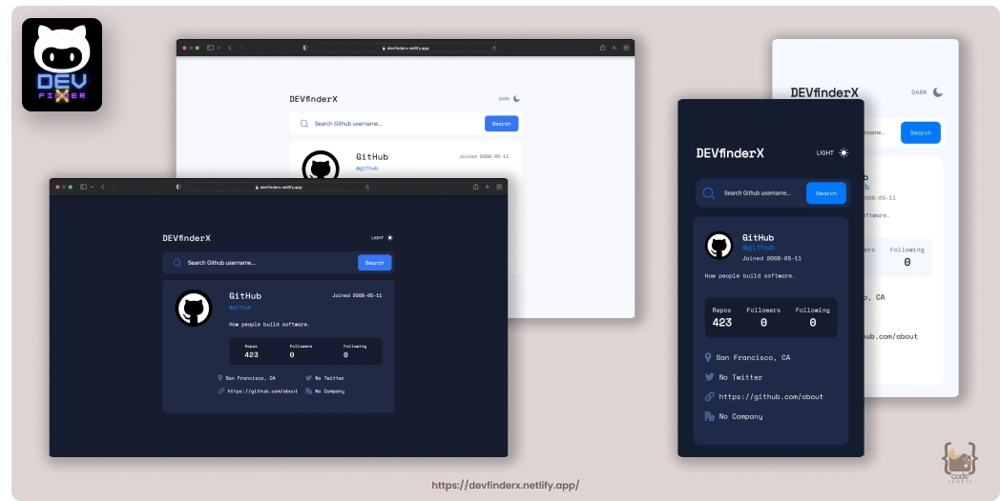
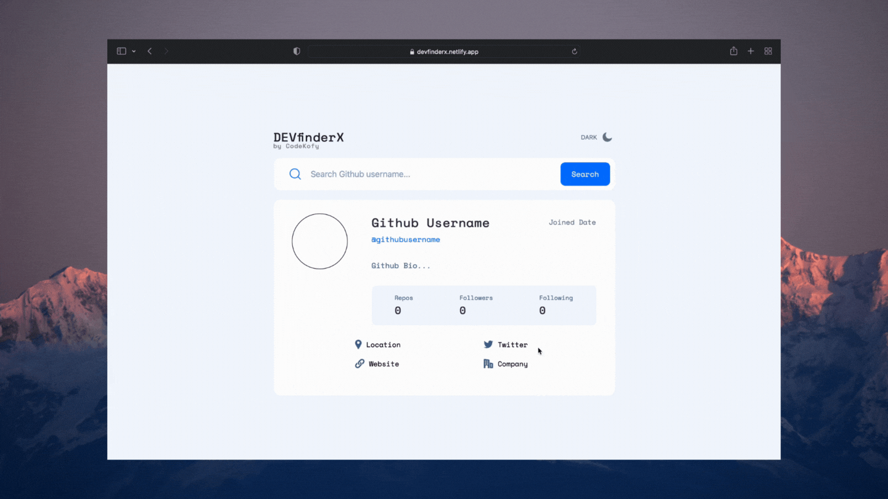

<h1 align="center">
   
  
   
  DEV-finderX
   
</h1>

<h4 align="center">A webtool that provides GitHub user details using <a href="https://api.github.com/" target="_blank">Github API</a>.</h4>

  <a href="#overview">Overview</a> •
  <a href="#built-with">Build with</a> •
  <a href="#links">Live links</a>

## Overview

### The challenge

Users should be able to:

- View the optimal layout for the app depending on their device's screen size
- Search for GitHub users by their username
- See relevant user information based on their search
- Switch between light and dark themes
- Researched `prefers-color-scheme` in CSS.

## Built with

- [![Html5][Html5]][Html5-url] [![CSS3][CSS3]][CSS3-url] [![javascript][javascript]][javascript-url]
- [![Github API][Github API]][Github API-url]
- Mobile-first workflow
- Flexbox and CSS Grid

## Links

- Solution URL: [GitHub](https://github.com/hafizmp/DevFinder)
- Live Site URL: [DEVfinderX](https://devfinderx.netlify.app/)

[Html5]: https://img.shields.io/badge/HTML5-CFD2CF?style=for-the-badge&logo=html5&logoColor=EB1D36
[Html5-url]: https://developer.mozilla.org/en-US/docs/Glossary/HTML5

[CSS3]: https://img.shields.io/badge/CSS3-293462?style=for-the-badge&logo=css3&logoColor=E7F6F2
[CSS3-url]: https://developer.mozilla.org/en-US/docs/Web/CSS

[javascript]: https://img.shields.io/badge/JAVASCRIPT-04293A?style=for-the-badge&logo=javascript&logoColor=FFF80A
[javascript-url]: https://developer.mozilla.org/en-US/docs/Web/javascript

[Github API]: https://img.shields.io/badge/GITHUB%20API-EEEEEE?style=for-the-badge&logo=github&logoColor=171717
[Github API-url]: https://api.github.com/
